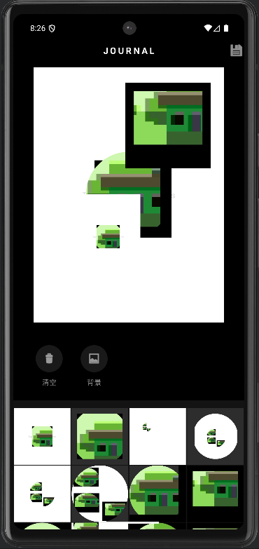

# SimplePhotoEditor

一个基于 **OpenGL ES 2.0** 与 **Android Jetpack** 构建的高性能安卓修图与拼贴应用。
本项目演示了如何在 Android 平台实现高效的图形渲染、手势交互与媒体管理，适合作为 Android 图形学入门或图片处理类应用的参考架构。

## 📸 项目简介 (Introduction)
SimplePhotoEditor 采用双页面架构设计，旨在提供流畅的图片采样与二次创作体验：
* **Sampler (采样器)**：基于 OpenGL 的图片裁剪工具。支持圆形/方形蒙版实时渲染，利用 Shader 算法实现防畸变显示与非破坏性裁剪。
* **Journal (拼贴板)**：支持多图层的自由拼贴画布。用户可以将采样后的素材（保留透明通道）自由组合，并保存为最终作品。

## ✨ 核心功能 (Features)

* **OpenGL 渲染引擎**：自定义 `GLSurfaceView.Renderer`，通过 GLSL 着色器实现纹理映射与动态蒙版（圆形/方形）。
* **高级手势交互**：
    * 支持双指缩放 (Scale) 与单指平移 (Translate)。
    * 实现了纹理坐标与顶点坐标的解耦，确保蒙版固定而图片移动，解决传统 OpenGL 图片拉伸问题。
* **多媒体管理**：
    * 基于 `MediaStore` API 的异步媒体加载，支持图片与视频（缩略图）混合显示。
    * 适配 Android 10+ 分区存储与 Android 13+ 媒体权限。
* **UI/UX 组件**：
    * 集成 `ViewPager2` 实现左右页面的无缝切换与数据联动。
    * 包含自定义 View (`ShimmerTextView`)，基于 `LinearGradient` 实现动态流光标题效果。
* **无损导出**：支持 `glReadPixels` 读取 GPU 渲染结果，并导出为带有 Alpha 通道的 PNG 图片。

## 🖼️ 截图展示 (Screenshots)

<table width="100%">
  <tr>
    <th width="50%">Sampler Mode (OpenGL Editor)</th>
    <th width="50%">Journal Mode (Sticker Collage)</th>
  </tr>
  <tr>
    <td>
      
    </td>
    <td>
      
    </td>
  </tr>
</table>


## 🛠️ 构建与运行 (Build & Run)

### 环境要求 (Prerequisites)
* Android Studio Iguana | 2023.2.1 或更高版本
* JDK 17
* Android SDK API Level 34 (或更高)
* Gradle 8.0+

### 部署步骤
1.  **克隆仓库**：
    ```bash
    git clone [https://github.com/NowhereMan-in-Galaxy/SimplePhotoEditor.git](https://github.com/NowhereMan-in-Galaxy/SimplePhotoEditor.git)
    ```
2.  **导入项目**：
    * 打开 Android Studio，选择 `Open`，导航至项目根目录。
    * 等待 Gradle Sync 完成依赖下载。
3.  **运行应用**：
    * 连接 Android 真机（推荐 Android 10.0+ 以获得最佳沉浸式体验）。
    * 选择 `app` 模块，点击 **Run** (绿色播放键)。

### 生成发布包
在 Android Studio 的 Terminal 中执行：
```bash
# 生成 APK
./gradlew assembleRelease

# 生成 AAB (Google Play)
./gradlew bundleRelease